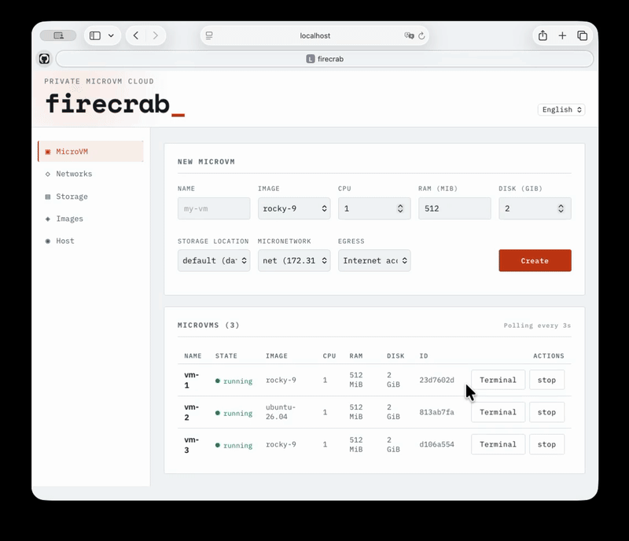
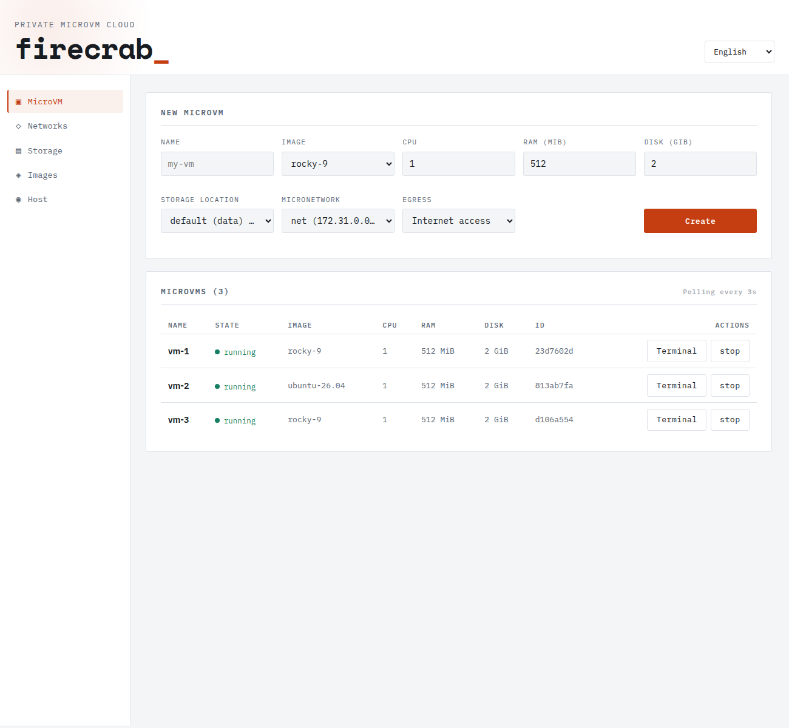
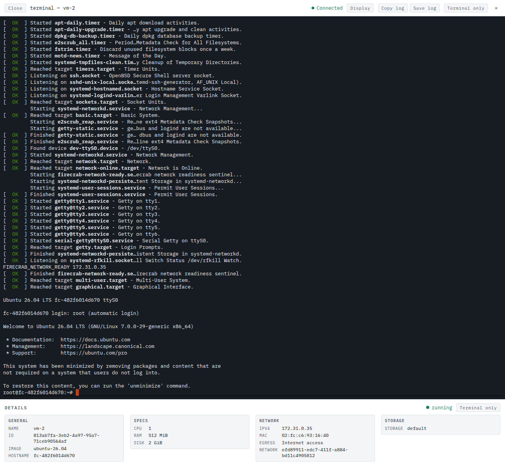
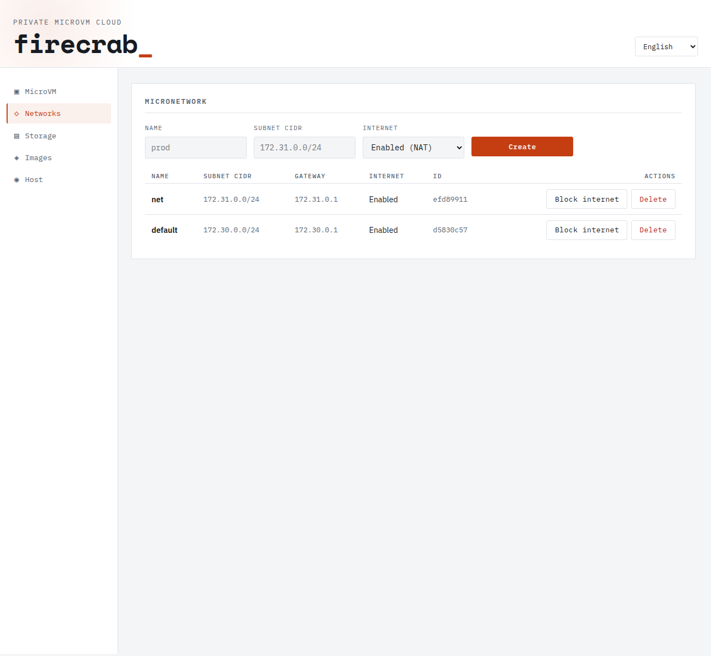
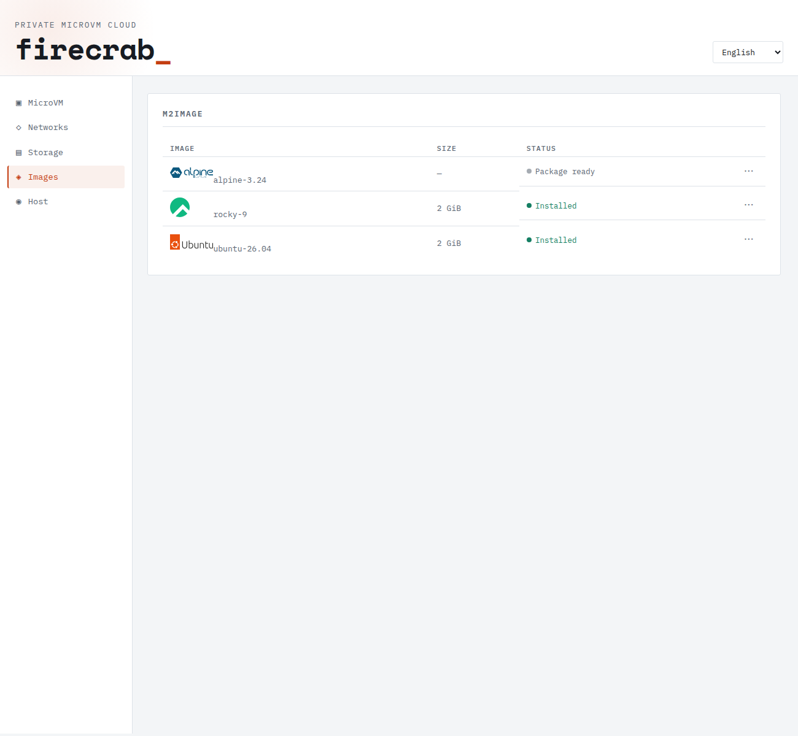

<p align="center">
  <a href="https://www.rust-lang.org"></a>
  <a href="https://codecov.io/gh/SteelCrab/firecrab"></a>
  <a href="https://www.linux.org"></a>
  <a href="./LICENSE"></a>
  <a href="./CHANGELOG.md"></a>
</p>

```text
███████ ██ ██████  ███████  ██████ ██████   █████  ██████
██      ██ ██   ██ ██      ██      ██   ██ ██   ██ ██   ██
█████   ██ ██████  █████   ██      ██████  ███████ ██████
██      ██ ██   ██ ██      ██      ██   ██ ██   ██ ██   ██
██      ██ ██   ██ ███████  ██████ ██   ██ ██   ██ ██████
```

<p align="center">自分のサーバーですぐ使える軽量 microVM プラットフォーム</p>

<p align="center">
  <a href="./README.md">English</a> ·
  <a href="./README.ko.md">한국어</a> ·
  <a href="./README.ja.md">日本語</a> ·
  <a href="./README.zh.md">中文</a> ·
  <a href="./README.id.md">Bahasa Indonesia</a>
</p>


## 概要

<details>
<summary>目的</summary>

自分で管理する Linux ホスト 1 台で Firecracker microVM を作成・運用します。ブラウザのダッシュボード・CLI・REST API で管理でき、個人サーバーやホームラボ、開発環境に適しています。

</details>

<details>
<summary>主な機能</summary>

- **VM 管理** — microVM の作成・起動・停止・削除とブラウザのシリアルコンソール。
- **イメージとディスク** — M2Image テンプレート、OCI イメージのインポート、MicroStorage によるディスク配置。
- **ネットワーク** — MicroNetwork サブネットと VM ごとのインターネット許可・隔離ポリシー。
- **ホスト環境** — Linux では直接実行、macOS・Windows では microManager を使用（Windows は Preview）。

</details>

<details>
<summary>プラットフォーム比較</summary>

| 主な項目 | **Firecrab** | [KVM + libvirt](https://libvirt.org/) | [OpenStack](https://docs.openstack.org/nova/latest/) |
| --- | --- | --- | --- |
| 目的 | 単一ホストの microVM 運用 | 汎用 VM 運用 | プライベートクラウド |
| 仮想化 | Firecracker + KVM | QEMU/KVM | 主に QEMU/KVM |
| 管理 | ダッシュボード・CLI・REST | libvirt API・CLI、GUI は別途 | Horizon・CLI・REST |
| 構成 | ホスト 1 台 | ホストごとの管理 | コントローラー・コンピュートサービス |

</details>

## アーキテクチャ

[詳細アーキテクチャ](public-docs/architecture.md): OS 別の microManager 構成、VM 起動、イメージ・カーネル供給、ゲスト機能、CLI・更新フロー。

### Firecrab の概要


1. ブラウザまたは CLI から操作し、M2Image・MicroNetwork・MicroStorage を選んで MicroVM を作成します。
2. Firecrab は M2Image を検証し、MicroNetwork を準備し、MicroStorage に VM 専用ディスクを作成します。
3. MicroVM ごとに一つの Firecracker プロセスを起動し、それぞれが独自のカーネルで起動します。
4. ゲストがネットワークの準備完了を通知すると、MicroVM は running になります。

### 各プラットフォームで実行


Linux は `install.sh` 一つで実行できます。macOS と Windows では `firecrab service install` が管理用 Debian VM を作成して同じ Firecrab を実行し、`localhost:5523` から同じダッシュボードを開きます。

macOS は Apple silicon M3 以降が必要で、Apple M5 で検証済みです。Windows は WSL2 で microVM を起動できないため Preview と表示されています。

Linux・Apple・Debian のロゴは simple-icons（CC0）、歯車アイコンは Lucide（ISC）です。ロゴと商標は各所有者に帰属します。

## インストール

<details>
<summary>Linux・macOS・Windows へのインストール</summary>

### Linux

Linux x86_64 または ARM64、使用可能な `/dev/kvm`、ネットワーク、`sudo` 権限のある一般ユーザーが必要です。インストーラーは **`sudo` を付けずに**そのユーザーで実行してください。KVM がなければ、先にハードウェア仮想化またはネストされた仮想化を有効にしてください。

```sh
curl -fsSL https://github.com/SteelCrab/firecrab/releases/latest/download/install.sh | bash
```

診断とアンインストールのオプションは[インストールガイド](public-docs/installation.md)を参照してください。Linux にリモート CLI だけを入れる場合は、下記のチェックサム確認を含む `install-cli.sh` 手順を使います。GNU/musl を自動選択し、既定では `~/.local/bin` にインストールします。

### macOS

Apple silicon、macOS 15 以降、ネストされた仮想化の実行時サポートが必要です（M3 以降、全体の検証は M5/macOS 26.6.2）。まずチェックサムを確認して CLI と helper をインストールします。

```sh
curl -fLO https://github.com/SteelCrab/firecrab/releases/latest/download/install-cli.sh
curl -fLO https://github.com/SteelCrab/firecrab/releases/latest/download/SHA256SUMS
grep ' install-cli.sh$' SHA256SUMS > install-cli.sh.sha256
if command -v sha256sum >/dev/null; then
  sha256sum -c install-cli.sh.sha256
else
  shasum -a 256 -c install-cli.sh.sha256
fi && sh install-cli.sh
```

続いてホストの対応状況を確認し、Debian 管理環境を構築します。

```sh
firecrab service doctor
firecrab service install
```

CLI のインストールだけでは管理 VM は作成されません。microManager は `Virtualization.framework`、独立した永続データディスク、常駐 launchd サービスを使います。[macOS ガイド](public-docs/micromanager-macos.md)を参照してください。

### Windows

x86_64 または ARM64 Windows、Microsoft Store の WSL2、ネストされた KVM が必要です。通常の PowerShell で CLI インストーラーを取得し、チェックサムを確認します。

```powershell
Invoke-WebRequest https://github.com/SteelCrab/firecrab/releases/latest/download/install-cli.ps1 -OutFile install-cli.ps1
Invoke-WebRequest https://github.com/SteelCrab/firecrab/releases/latest/download/SHA256SUMS -OutFile SHA256SUMS
$expected = ((Get-Content SHA256SUMS | Where-Object { $_ -match ' install-cli\.ps1$' }) -split '\s+')[0]
if ((Get-FileHash install-cli.ps1 -Algorithm SHA256).Hash -ne $expected) { throw 'installer checksum mismatch' }
& ./install-cli.ps1
```

`firecrab` がまだ `PATH` にない場合は新しい PowerShell を開き、対応状況の確認とインストールを実行してください。ARM64 のインストールは全体の検証が未完了です。[Windows ガイド](public-docs/micromanager-windows.md)を参照してください。

```powershell
firecrab service doctor
firecrab service install
```

**Windows の制約:** 現在固定されている v0.2.2 ゲストでは、標準 WSL2 で API・イメージ・ネットワークは使えますが、MicroVM を起動できません。net-helper の修正を含む新しいゲストリリースが必要で、ローカル nginx VM も対象です。Windows CLI から対応するリモート Linux ホストを管理することはできます。

</details>

## 実行

<details>
<summary>Linux・macOS・Windows での起動と停止</summary>

### Linux

インストーラーは二つの systemd サービスを起動します。以降の起動・状態確認・停止には次を使います。

```sh
sudo systemctl start firecrab-helper firecrab-api
systemctl status firecrab-helper firecrab-api
sudo systemctl stop firecrab-api firecrab-helper
```

### macOS

microManager が常駐管理 VM と localhost API トンネルを起動します。

```sh
firecrab service start
firecrab service status
firecrab service debug --logs --tail 100
firecrab service stop
```

### Windows

microManager がユーザー別のスケジュールタスクで WSL2 管理ディストリビューションを維持します。

```powershell
firecrab service start
firecrab service status
firecrab service debug --logs --tail 100
firecrab service stop
```

**Windows の制約:** 現在固定されている v0.2.2 ゲストでは、標準 WSL2 で API・イメージ・ネットワークは使えますが、MicroVM を起動できません。net-helper の修正を含む新しいゲストリリースが必要で、ローカル nginx VM も対象です。Windows CLI から対応するリモート Linux ホストを管理することはできます。

正常なら `http://127.0.0.1:5523/` を開きます。MicroNetwork を作成し、インストール済みイメージを選んで VM を作成・起動し、`running` になったら Terminal を開きます。リモートホストには [CLI ホストプロファイル](public-docs/firecrab-cli.md#host-profiles)を設定してください。

</details>

## ソースから実行

<details>
<summary>Linux API・ダッシュボード / macOS・Windows CLI</summary>

リポジトリルートで指定された [Rust ツールチェーン](rust-toolchain.toml)、Node.js 22 以降、npm を使います。実際の VM 実行には Linux KVM と[ホストの前提条件](public-docs/installation.md)も必要です。

### Linux

三つの端末を使います。helper は特権で、API は一般ユーザーで実行します。ローカルデータのパスはリポジトリルートが基準です。

```sh
# 1
cargo build -p firecrab-helper --locked
sudo -u root -g "$(id -gn)" FIRECRAB_NET_HELPER_ALLOWED_UID="$(id -u)" \
  ./target/debug/firecrab-helper

# 2
cargo run -p firecrab-api --locked

# 3
npm ci --prefix firecrab-frontend
npm run dev --prefix firecrab-frontend
# http://localhost:8080/
```

ビルド済みダッシュボードを API から配信するには、開発用 API を停止して次を実行します。

```sh
npm run build --prefix firecrab-frontend
FIRECRAB_STATIC_ROOT="$PWD/firecrab-frontend/dist" cargo run -p firecrab-api --locked
# http://127.0.0.1:5523/
```

### macOS

チェックアウトの CLI と署名済みネイティブ helper をビルドし、管理サービスをインストールします。既にインストール済みなら `service start` を使います。

```sh
cargo build -p firecrab-cli --locked
scripts/build-micromanager-macos.sh target/debug/firecrab-micromanager-macos
./target/debug/firecrab service install
./target/debug/firecrab service status
```

### Windows

PowerShell でチェックアウトの CLI をビルドして管理サービスをインストールします。既にインストール済みなら `service start` を使います。

```powershell
cargo build -p firecrab-cli --locked
.\target\debug\firecrab.exe service install
.\target\debug\firecrab.exe service status
```

macOS・Windows のコマンドはソースからビルドした CLI/helper とインストール済みゲスト API を実行します。Debian 内の変更した `firecrab-api` ソースを**再ビルドしません**。API/net-helper 全体の開発は Linux で行い、管理サービスの開発は上記の各プラットフォームガイドを参照してください。

</details>

## テスト

<details>
<summary>チェック・カバレッジ・ブラウザ E2E</summary>

リポジトリルートで実行する基本チェック:

```sh
cargo fmt --all -- --check
cargo clippy --workspace --all-targets -- -D warnings
cargo test --workspace --locked
npm ci --prefix firecrab-frontend
npm run lint --prefix firecrab-frontend
npm run build --prefix firecrab-frontend
python3 scripts/check-doc-links.py
python3 scripts/check-changelog.py
```

任意のローカルカバレッジ（`cargo-llvm-cov` が必要）:

```sh
cargo llvm-cov --workspace --locked --lcov --output-path lcov.info
```

ゲスト起動を省略するブラウザ E2E:

```sh
npm ci --prefix firecrab-e2e
npm run install-browsers --prefix firecrab-e2e
FIRECRAB_E2E_SKIP_GUEST_BOOT=1 npm test --prefix firecrab-e2e
```

PowerShell では `npm test --prefix firecrab-e2e` の前に `$env:FIRECRAB_E2E_SKIP_GUEST_BOOT="1"` を設定します。ゲスト起動を省略するため、KVM や nginx HTTP は検証しません。ゲスト実行と全インストールチェックは [TEST.md](public-docs/TEST.md)、[韓国語チェックリスト](public-docs/TEST.ko.md)、[E2E ガイド](firecrab-e2e/README.md)を参照してください。

</details>

## 使い方: nginx

<details>
<summary>nginx のインポート → microVM 作成 → HTTP 接続</summary>

API と CLI が動作する対応 Linux ホスト、または macOS microManager を使います。以下は Linux/macOS の POSIX シェル用です。ダッシュボードの Images → OCI Import、Networks、MicroVM でも同じ操作ができます。

1. イメージを確認してインポートします。ジョブが成功し `nginx-1.27` がインストールされるまで状態確認を繰り返します。

```sh
firecrab image inspect nginx:1.27
firecrab image import nginx:1.27
firecrab image import-status nginx-1.27
```

2. 重複しないサブネットでネットワークを作成します。最初のコマンドが返す UUID で `NETWORK_ID` を置き換えてください。

```sh
firecrab network create --name nginx-net --subnet-cidr 172.31.20.0/24
firecrab vm create --name nginx-demo --template nginx-1.27 --network NETWORK_ID
```

3. VM 作成結果の UUID で `VM_ID` を置き換え、起動して一覧が `running` になるまで待ちます。

```sh
firecrab vm start VM_ID
firecrab vm list
```

4. REST API で TCP ホストポート `8081` → ゲストポート `80` を設定し、nginx の応答を確認します。この PUT は VM のポート転送リスト全体を置き換えるため、残すルールもリクエストに含めてください。

```sh
curl -fsS -X PUT http://127.0.0.1:5523/api/vms/VM_ID/port-forwards \
  -H 'Content-Type: application/json' \
  -d '{"portForwards":[{"hostPort":8081,"guestPort":80,"protocol":"tcp"}]}'
```

Linux では別のマシンから `http://FIRECRAB_HOST_IP:8081/` を確認します。DNAT はホスト自身の loopback 接続を提供しません。macOS では TCP リレーの `http://127.0.0.1:8081/` を使います。リモート接続時はホストとルーターのファイアウォールでも 8081 を許可してください。

```sh
curl -I http://FIRECRAB_HOST_IP:8081/
# macOS
curl -I http://127.0.0.1:8081/
```

OCI import は `/etc/firecrab/busybox` を PID 1 とする起動可能な rootfs を作成し、nginx のエントリーポイントをサービスとして実行します。`EXPOSE 80` だけではホストポート転送は作成されません。[OCI イメージ](public-docs/oci.md)と[ネットワーク](public-docs/networking.md)を参照してください。

例の VM を停止するには:

```sh
firecrab vm stop VM_ID
```

<details>
<summary>ダッシュボードの画面案内</summary>



ダッシュボードは左側のナビゲーションで、日常的な操作を **MicroVM**、VM ごとの
**ターミナル**、**ネットワーク**、**イメージ** に分けています。

### MicroVM

フォームで名前、イメージ、CPU、RAM、ディスク、ストレージの配置先、MicroNetwork、外向き通信
ポリシーを選んで VM を作成します。下の一覧は状態、イメージ、リソース、ID を 3 秒ごとに更新し、
実行中の VM には **ターミナル** と **停止** 操作が表示されます。VM 名を選択すると、起動の進捗、
ログ、ネットワーク、ストレージなどの詳細を確認できます。



### ターミナル

実行中の VM の **ターミナル** は、別タブで開くブラウザのシリアルコンソールです。起動出力と
ログインプロンプトをリアルタイムに表示し、コマンドを入力できます。ツールバーで表示設定を変え、
コンソールログのコピー・保存やターミナルのみの表示に切り替えられます。下部パネルには VM の
一般情報、仕様、ネットワーク、ストレージが表示されます。



### ネットワーク

名前、サブネット CIDR、インターネットポリシーを指定して **MicroNetwork** を作成します。一覧には
各ネットワークのゲートウェイ、インターネット状態、ID が表示されます。**インターネットを遮断/接続**
でネットワーク全体の NAT 経由の外向き通信を変更したり、削除したりできます。行を選択すると、
サブネットのアドレス使用量、bridge/TAP、NAT、ファイアウォール、所属 VM の詳細を確認できます。



### イメージ

**M2Image** の一覧には、イメージごとのサイズと `パッケージ準備完了`・`インストール済み` などの
状態が表示されます。行を選択すると、別名、バージョン、最小ディスク、rootfs サイズ、状態、その
イメージを使う VM を確認できます。`…` メニューには状態に応じて、パッケージのインストール、
ブートストラップ、削除が表示されます。VM 作成に使えるのはインストール済みのイメージだけです。

同じ画面で OCI 参照（`nginx:1.27`）がこのホストのアーキテクチャに合うかを検査し、
テンプレートとして import できます。import はバックグラウンドジョブで、進捗・エラー・
登録された別名をページに出します。



リクエスト形式、ライフサイクルの意味、エラー envelope は[API ガイド](public-docs/api.md)を、
イメージパッケージとブラウザ主導のブートストラップは[イメージガイド](public-docs/images.md)を、
OCI の inspect と import は [OCI イメージガイド](public-docs/oci.md) を参照してください。

</details>

</details>

## ドキュメントと貢献

既定のドキュメント言語は英語です。上のリンクから韓国語・日本語・中国語・インドネシア語 README を選べます。ダッシュボードは英語と韓国語に対応します。

- [public-docs/](public-docs/README.md): インストール・API・運用・トラブルシューティング
- [CONTRIBUTING.md](CONTRIBUTING.md): メンテナーのノート・開発環境・PR チェック

[Apache License, Version 2.0](LICENSE) で公開されています。
