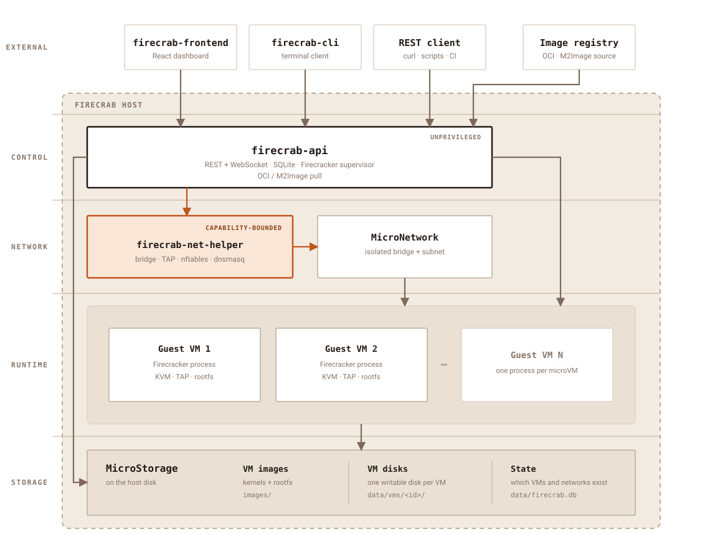

<p align="center">
  <a href="https://www.rust-lang.org"></a>
  <a href="https://codecov.io/gh/SteelCrab/firecrab"></a>
  <a href="https://www.linux.org"></a>
  <a href="./LICENSE"></a>
  <a href="./CHANGELOG.md"></a>
</p>

```text
███████ ██ ██████  ███████  ██████ ██████   █████  ██████
██      ██ ██   ██ ██      ██      ██   ██ ██   ██ ██   ██
█████   ██ ██████  █████   ██      ██████  ███████ ██████
██      ██ ██   ██ ██      ██      ██   ██ ██   ██ ██   ██
██      ██ ██   ██ ███████  ██████ ██   ██ ██   ██ ██████
```

<p align="center">A lightweight microVM platform for your own server.</p>

<p align="center">
  <a href="./README.ko.md">한국어</a> ·
  <a href="./README.zh.md">中文</a> ·
  <a href="./README.ja.md">日本語</a>
</p>

**firecrab runs [Firecracker](https://firecracker-microvm.github.io/) microVMs on one
Linux host you control.** Creating a VM also means choosing its image, network, disk
location, and outbound-access policy — from a browser dashboard, a CLI, or REST.

It is built for a private, single-host microVM environment: stronger isolation than
containers, without a full cloud control plane. It is not a hosted service and not a
multi-host scheduler.


## Install

You need a Linux host with `/dev/kvm`, network access, and a user allowed to run
`sudo`. Run the installer as that regular user — do **not** prefix it with `sudo`. It
downloads release binaries and calls `sudo` only for the package, systemd, and
host-setup steps that require it.

```sh
curl -fsSL https://github.com/SteelCrab/firecrab/releases/latest/download/install.sh | bash
```

```sh
./install.sh --check              # report prerequisites and planned changes
./install.sh --doctor             # diagnose KVM, firewall, socket, and host setup
./install.sh --libc musl          # pick a libc instead of autodetecting gnu/musl
./install.sh --uninstall          # retain data by default
./install.sh --uninstall --purge  # also remove /var/lib/firecrab
```

The installer cannot enable KVM. If `/dev/kvm` is missing, turn on hardware (or
nested) virtualization first. Every option, install path, and troubleshooting step is
in the [installation guide](public-docs/installation.md).

## Quick start

Open `http://127.0.0.1:5523/` after installation, then:

1. Create a **MicroNetwork**.
2. Choose an installed image and create a VM in that network.
3. Start the VM, wait for `running`, then open **Terminal**.

Creating the network first is intentional: firecrab has no hidden default subnet, so
every VM sits in a network the operator chose.

## What you get

- **microVM lifecycle** — create, inspect, edit inactive VMs, start, stop, delete, and
  reach each VM through a browser serial console.
- **Isolated networks** — explicit **MicroNetworks**, each VM holding a persistent
  IPv4, MAC, and hostname. Networks are isolated from one another, with per-VM
  internet or isolated egress.
- **Images and disks** — install M2Image templates, import an OCI image from a
  registry, bootstrap supported distributions in a temporary builder VM, and place VM
  disks on configured storage roots or **MicroStorage** pools.
- **Visibility** — startup progress, console logs, and host status in the dashboard,
  in English and Korean.
- **A small privilege surface** — the API runs unprivileged; only the separate
  `firecrab-net-helper` holds the capabilities host networking needs.

## Architecture

One Linux host. One unprivileged API. One capability-bounded helper. One Firecracker
process per running guest. No multi-host scheduler.

<picture>
  <source media="(prefers-color-scheme: dark)" srcset="assets/architecture/firecrab-architecture-dark.svg">
  
</picture>

| Layer | Piece | Job |
| --- | --- | --- |
| External | `firecrab-frontend` | VM, network, image, storage, and console UI |
| External | `firecrab-cli` | The same operations from a terminal |
| Control | `firecrab-api` | REST, WebSocket, lifecycle, SQLite, artifact checks |
| Network | `firecrab-net-helper` | Bridge, TAP, DHCP, DNS, NAT, firewall, port forwards |
| Runtime | Firecracker | One process per running guest |
| Storage | MicroStorage | Kernels, rootfs images, VM disks, SQLite state |

A MicroNetwork is one IPv4 subnet on its own bridge. Guests on the same network talk
over that bridge; different networks are blocked. Internet NAT needs both the network
`internetEnabled` switch and the VM `egressPolicy`.

An imported OCI image is not a bootable OS on its own. firecrab turns the registry
tree into a Firecracker rootfs, boots busybox as PID 1, and runs the image entrypoint
as a service — so `/proc/1/exe` is `/etc/firecrab/busybox`, never the image's `init`.

Full detail: [architecture](public-docs/architecture.md) ·
[MicroNetwork](public-docs/micro-network.md) · [OCI images](public-docs/oci.md) ·
[API](public-docs/api.md).

## How it compares

firecrab targets the gap between running `firecracker` by hand and standing up
OpenStack: one server, a web dashboard, and named primitives for images
(**M2Image**), networks (**MicroNetwork**), and disks (**MicroStorage**). It trades
clustering and HA for a control plane you can read in an afternoon.

<details>
<summary>Full comparison table</summary>

| Category | **Firecrab** | VMware / ESXi | KVM + libvirt | OpenStack | Firecracker alone |
| --- | --- | --- | --- | --- | --- |
| Basic unit | **microVM** | VM | VM | VM | microVM |
| Virtualization | Firecracker + KVM | VMware hypervisor | KVM/QEMU | Mainly KVM/QEMU | KVM |
| Main goal | **Simple microVM operation on one server** | Enterprise virtualization | General-purpose Linux virtualization | Large private cloud | Run microVMs |
| Management complexity | **Designed to be low** | Medium | Medium–high | **Very high** | High |
| Web dashboard | ✅ | ✅ | Separate setup | ✅ | ❌ |
| VM images | **M2Image** | Template/Image | qcow2, etc. | Glance | Manual |
| Virtual network | **MicroNetwork** | vSwitch | bridge/libvirt network | Neutron | Manual implementation |
| Disk management | **MicroStorage** | Datastore/VMDK | qcow2/LVM, etc. | Cinder | Manual implementation |
| Browser console | ✅ | ✅ | Setup required | ✅ | ❌ |
| VM isolation | **Strong** | Strong | Strong | Strong | **Strong** |
| Boot speed | **Very fast** | Relatively slow | Relatively slow | Relatively slow | **Very fast** |
| Resource overhead | **Low** | High | Medium | High | **Very low** |
| Control plane | **Minimal** | Included | Almost none | **Large-scale** | None |
| Single-server operation | **Primary goal** | Supported | Supported | Inefficient | Supported |
| Cluster / HA | Limited / future extension | ✅ | Separate setup | ✅ | ❌ |
| Kubernetes integration | Possible future runtime | Supported | Supported | Supported | containerd integration available |
| Best fit | **Personal server, homelab, edge, development server** | Enterprise datacenter | Linux server | Large cloud | Serverless/container infrastructure |

</details>

## Dashboard

The left navigation splits daily work into **MicroVM**, a per-VM **Terminal**,
**Networks**, and **Images**.

### MicroVM

Create a VM from its name, image, CPU, RAM, disk, storage location, MicroNetwork, and
egress policy. The list refreshes state, image, resources, and ID every three seconds;
running VMs expose **Terminal** and **stop**. Select a VM name for startup progress,
logs, network, and storage detail.


### Terminal

**Terminal** opens a running VM's serial console in a separate tab, streaming boot
output and the login prompt in real time. The toolbar adjusts display settings, copies
or saves console logs, and switches to a terminal-only view.


### Networks

Create a **MicroNetwork** from its name, subnet CIDR, and internet policy. **Block
internet** and **Enable internet** change NAT-backed outbound access for the whole
network. Selecting a row reveals subnet address use, bridge/TAP, NAT, firewall, and
member VMs.


### Images

The **M2Image** list shows each image's size and state, such as `Package ready` or
`Installed`. The `…` menu offers state-appropriate package install, bootstrap, or
delete actions. Only installed images can create VMs.

The same screen inspects an OCI reference (`nginx:1.27`) for this host's architecture
and imports it as a registered template. Import runs as a background job with
progress, errors, and the resulting alias.


See the [image guide](public-docs/images.md), the [OCI image guide](public-docs/oci.md),
and the [API guide](public-docs/api.md).

## Develop from source

Use three terminals: the network helper, the API, and the Vite dashboard. Run the API
from the repository root, because its local data paths are relative to the working
directory.

```sh
# Terminal 1 — privileged network operations
cargo build -p firecrab-net-helper
sudo -u root -g "$(id -gn)" FIRECRAB_NET_HELPER_ALLOWED_UID="$(id -u)" \
  ./target/debug/firecrab-net-helper

# Terminal 2 — API and Firecracker manager
pkill -x firecrab-api 2>/dev/null || true
cargo run -p firecrab-api

# Terminal 3 — dashboard at http://localhost:8080/
pkill -f '[f]irecrab-frontend/node_modules/.bin/vite' 2>/dev/null || true
npm install --prefix firecrab-frontend
npm run dev --prefix firecrab-frontend
```

For a production-like local run, build the dashboard and let the API serve it:

```sh
npm run build --prefix firecrab-frontend
FIRECRAB_STATIC_ROOT="$PWD/firecrab-frontend/dist" cargo run -p firecrab-api
# http://127.0.0.1:5523/
```

Tests:

```sh
cargo test --workspace

# browser E2E for OCI inspect → import, against a local registry fixture
npm install --prefix firecrab-e2e
npm run install-browsers --prefix firecrab-e2e
FIRECRAB_E2E_SKIP_GUEST_BOOT=1 npm test --prefix firecrab-e2e
```

The E2E command expects 1 passed and 1 skipped. The skipped test creates and boots a
VM; drop the flag on a KVM host with Firecracker and `./scripts/dev-net-helper.sh`
running. See [firecrab-e2e/README.md](firecrab-e2e/README.md) and the
[web dashboard guide](public-docs/dashboard.md).

## Documentation

The English technical documentation in [`public-docs/`](public-docs/README.md) covers
architecture, installation, operations, API contracts, and troubleshooting.

## Contributing

<p align="center">
  <a href="./CONTRIBUTING.md">
    
  </a>
</p>

See [CONTRIBUTING.md](./CONTRIBUTING.md) for the [maintainer’s note](./CONTRIBUTING.md#a-note-from-the-maintainer),
development setup, checks, pull request expectations, and documentation rules.

## License

Licensed under the [Apache License, Version 2.0](./LICENSE).
