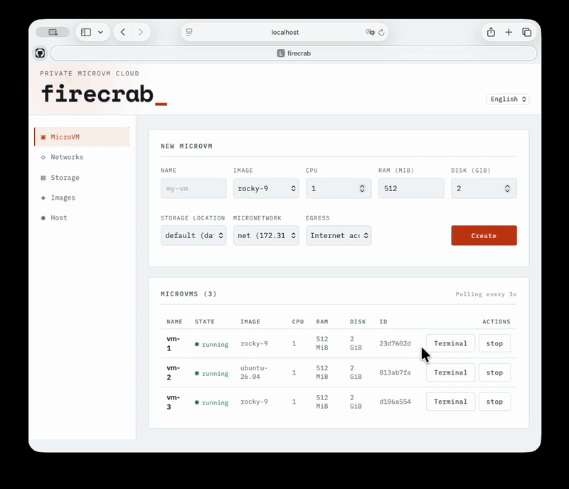
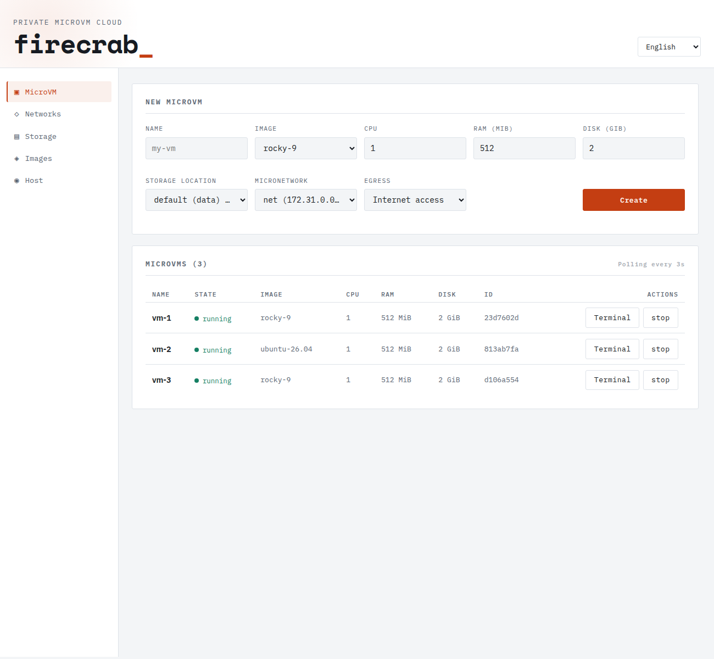
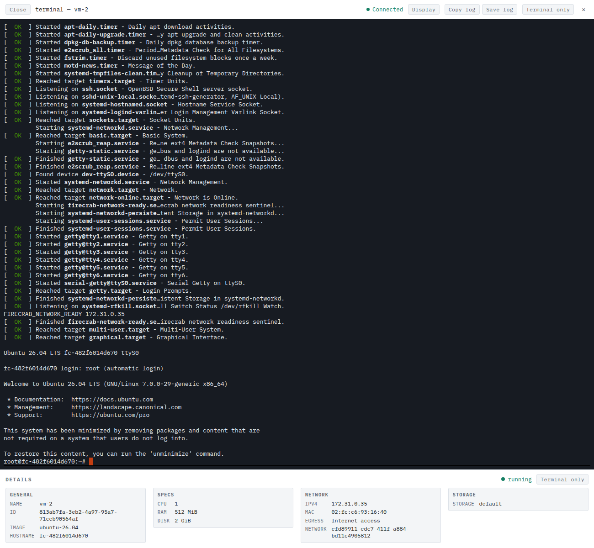
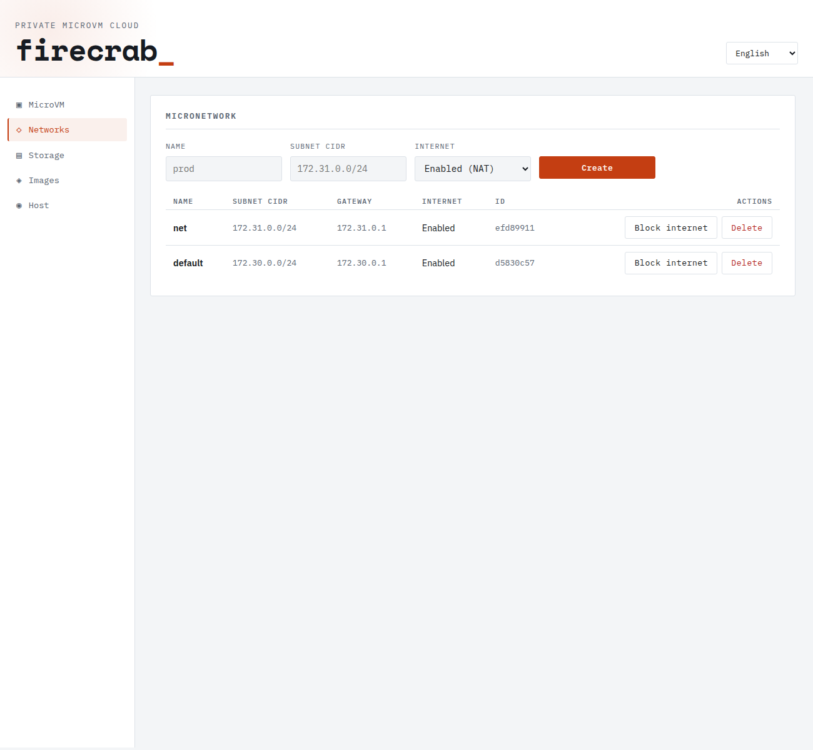
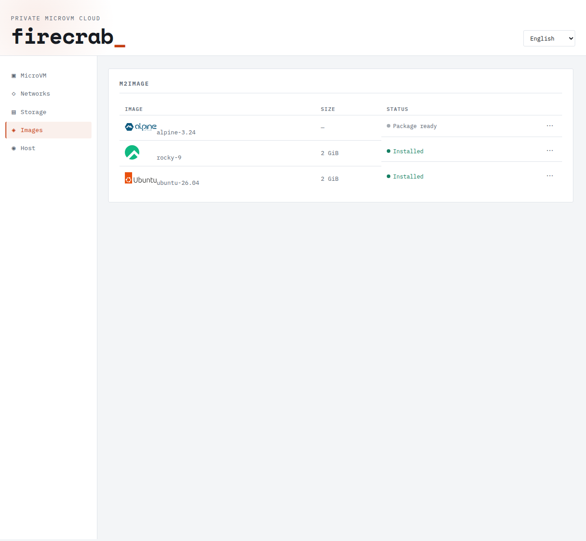

<p align="center">
  <a href="https://www.rust-lang.org"></a>
  <a href="https://codecov.io/gh/SteelCrab/firecrab"></a>
  <a href="https://www.linux.org"></a>
  <a href="./LICENSE"></a>
</p>

<h1 align="center">firecrab</h1>

<p align="center">可直接运行在自有服务器上的轻量 microVM 平台</p>

<p align="center">
  <a href="./README.md">English</a> ·
  <a href="./README.ko.md">한국어</a> ·
  <a href="./README.ja.md">日本語</a>
</p>

firecrab 在你管理的 Linux 主机上运行和管理隔离的
[Firecracker](https://firecracker-microvm.github.io/) microVM。它把 Rust API、浏览器
仪表盘和两个小型系统服务组合在一起；创建 VM 时可同时选择镜像、网络、磁盘位置和出站策略。

它面向私有的单主机 microVM 环境：适合需要比容器更强隔离、但不需要完整云控制平面的工作负载。
它不是托管服务，也不是多主机调度器。

## 核心功能

- **运行 microVM：** 创建、查看、编辑未运行的 VM、启动、停止、删除，并使用每台 VM 的
  浏览器串口控制台。
- **选择隔离网络：** 创建显式 **MicroNetwork**，每台 VM 都放入其中之一。IPv4、MAC 和
  hostname 会保留；网络彼此隔离，并可为每台 VM 选择互联网或隔离 egress。
- **管理镜像与磁盘：** 安装或删除模板，在临时 builder VM 中引导支持的发行版，并将 VM 磁盘
  放在配置的存储根目录或已注册的 **MicroStorage** 池中。
- **了解运行状态：** 在英文或韩文仪表盘中查看启动进度、控制台日志和主机状态。
- **缩小主机权限：** API 以非特权方式运行；独立的 `firecrab-net-helper` 仅持有主机网络
  所需的 capability。

## 平台比较

| 类别 | **Firecrab** | VMware / ESXi | KVM + libvirt | OpenStack | 单独使用 Firecracker |
| --- | --- | --- | --- | --- | --- |
| 基本单位 | **microVM** | 普通 VM | 普通 VM | 普通 VM | microVM |
| 虚拟化基础 | Firecracker + KVM | VMware Hypervisor | KVM/QEMU | 主要为 KVM/QEMU | KVM |
| 主要目标 | **在单台服务器上简单运行 microVM** | 企业虚拟化 | 通用 Linux 虚拟化 | 大型私有云 | 运行 microVM |
| 管理难度 | **力求简单** | 中等 | 中等~较高 | **非常高** | 高 |
| Web 仪表盘 | ✅ | ✅ | 需单独搭建 | ✅ | ❌ |
| VM 镜像管理 | **M2Image** | Template/Image | qcow2 等 | Glance | 手动管理 |
| 虚拟网络 | **MicroNetwork** | vSwitch | bridge/libvirt network | Neutron | 手动实现 |
| 磁盘管理 | **MicroStorage** | Datastore/VMDK | qcow2/LVM 等 | Cinder | 手动实现 |
| 浏览器控制台 | ✅ | ✅ | 需要配置 | ✅ | ❌ |
| VM 隔离 | **强** | 强 | 强 | 强 | **强** |
| 启动速度 | **非常快** | 相对较慢 | 相对较慢 | 相对较慢 | **非常快** |
| 资源开销 | **低** | 高 | 中等 | 高 | **非常低** |
| 控制平面 | **最小化** | 有 | 几乎没有 | **大规模** | 无 |
| 单服务器运行 | **核心目标** | 可以 | 可以 | 效率较低 | 可以 |
| 集群/HA | 有限 / 扩展方向 | ✅ | 需单独配置 | ✅ | ❌ |
| Kubernetes 集成 | 未来可扩展 Runtime | 可以 | 可以 | 可以 | 可与 containerd 集成 |
| 适用环境 | **个人服务器、家庭实验室、边缘、开发服务器** | 企业数据中心 | Linux 服务器 | 大型云 | serverless/container 基础设施 |

## 架构

```text
浏览器仪表盘 / REST 客户端
              │ HTTP + WebSocket
              ▼
  firecrab-api（Rust、SQLite、Firecracker 进程管理器）
       │                         │
       │ Unix socket             └── Firecracker → 每个 microVM 一个进程
       ▼
firecrab-net-helper（特权、capability 受限）
       └── bridge · TAP · nftables · dnsmasq
```

API 会在使用前验证模板工件；已安装的部署中，API 也会直接提供构建后的仪表盘。详见
[架构文档](public-docs/architecture.md)。

## 在 Linux 主机上安装

需要一台具有 `/dev/kvm`、网络访问和可使用 `sudo` 的普通用户的 Linux 主机。请以该普通用户
运行安装程序，**不要**在脚本前加 `sudo`。它会让源码构建和用户工具归调用用户所有，只对软件包、
systemd 与主机设置等需要权限的单独操作在内部使用 `sudo`。

```sh
git clone https://github.com/SteelCrab/firecrab.git
cd firecrab
./install.sh
```

常用安装选项：

```sh
./install.sh --check                 # 报告前置条件和计划变更
./install.sh --doctor                # 诊断 KVM、防火墙、socket 和主机设置
./install.sh --with-ubuntu-image
./install.sh --with-rocky-image
./install.sh --uninstall         # 默认保留数据
./install.sh --uninstall --purge # 同时删除 /var/lib/firecrab
```

默认安装会构建仪表盘和 Alpine 客户机镜像。脚本不能启用 KVM：若没有 `/dev/kvm`，请先启用硬件
虚拟化（或嵌套虚拟化）。所有选项、安装路径、升级和排错请参阅[安装指南](public-docs/installation.md)。

## 快速开始

安装后打开 `http://127.0.0.1:3000/`，然后：

1. 创建 **MicroNetwork**。
2. 选择已安装的镜像，并在该网络中创建 VM。
3. 启动 VM，待其变为 `running` 后打开 **Terminal**。

先创建网络是有意的：firecrab 没有隐藏的默认子网，每台 VM 都放在操作者选择的网络中。

## 仪表盘导览



仪表盘通过左侧导航将日常操作分为 **MicroVM**、每台 VM 的 **终端**、**网络** 和
**镜像**。

### MicroVM

在表单中选择名称、镜像、CPU、RAM、磁盘、存储位置、MicroNetwork 和出站策略后创建 VM。下方列表
每三秒刷新状态、镜像、资源和 ID；运行中的 VM 会显示 **终端** 和 **停止** 操作。选择 VM 名称可查看
启动进度、日志、网络、存储及其他详情。



### 终端

运行中的 VM 可通过 **终端** 在独立标签页打开浏览器串口控制台。它实时显示启动输出与登录提示并接受
命令。工具栏可调整显示设置、复制或保存控制台日志，以及切换到仅终端视图；下方各面板显示 VM 的
常规信息、规格、网络和存储。



### 网络

可使用名称、子网 CIDR 和互联网策略创建 **MicroNetwork**。列表显示每个网络的网关、互联网状态和
ID；可通过 **阻止互联网/启用互联网** 改变整个网络经 NAT 的出站访问，或删除该网络。选择一行可查看
子网地址使用情况、bridge/TAP、NAT、防火墙和成员 VM 的详情。



### 镜像

**M2Image** 列表显示每个镜像的大小及 `软件包已就绪`、`已安装` 等状态。选择一行可查看其别名、
版本、最小磁盘、rootfs 大小、状态以及正在使用该镜像的 VM。`…` 菜单会根据状态提供软件包安装、
镜像导入、引导或删除操作。只有已安装的镜像可以用于创建 VM。



请求格式、生命周期语义和错误 envelope 见 [API 指南](public-docs/api.md)。镜像包与浏览器引导
流程见[镜像指南](public-docs/images.md)。

## 从源码开发

使用三个终端：network helper、API 和 Vite 仪表盘。由于本地数据路径相对于工作目录，必须从
仓库根目录运行 API。

```sh
# 终端 1 — 特权网络操作
cargo build -p firecrab-net-helper
sudo -u root -g "$(id -gn)" FIRECRAB_NET_HELPER_ALLOWED_UID="$(id -u)" \
  ./target/debug/firecrab-net-helper

# 终端 2 — API 与 Firecracker 管理器
# 可选：仅结束本仓库的 firecrab-api（没有则忽略）
pkill -x firecrab-api 2>/dev/null || true
cargo run -p firecrab-api

# 终端 3 — 仪表盘：http://localhost:8080/
# 可选：仅结束本 checkout 的 Vite（没有则忽略）
pkill -f '[f]irecrab-frontend/node_modules/.bin/vite' 2>/dev/null || true
npm install --prefix firecrab-frontend
npm run dev --prefix firecrab-frontend
```

如要在本地模拟生产部署，请构建仪表盘并让 API 直接提供它：

```sh
npm run build --prefix firecrab-frontend
FIRECRAB_STATIC_ROOT="$PWD/firecrab-frontend/dist" cargo run -p firecrab-api
# http://127.0.0.1:3000/
```

运行 Rust 测试套件：

```sh
cargo test --workspace
```

更多开发说明和浏览器工作流见[网页仪表盘指南](public-docs/dashboard.md)。

## 文档

英文技术文档 [`public-docs/`](public-docs/README.md) 包含架构、安装、运维、API 合约和故障排查指南。

## 贡献

<p align="center">
  <a href="./CONTRIBUTING.md#a-note-from-the-maintainer">
    
  </a>
</p>

[维护者的话](./CONTRIBUTING.md#a-note-from-the-maintainer)、开发环境、检查项、PR 约定与文档规则见
[CONTRIBUTING.md](./CONTRIBUTING.md)。

## 许可证

采用 [Apache License, Version 2.0](./LICENSE)。
