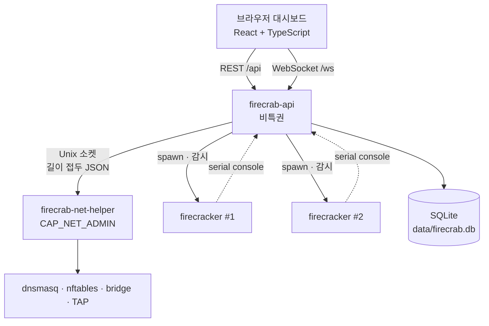

---
tags:
  - firecrab
  - overview
updated: 2026-07-30
---

# 아키텍처

> [!summary] 한 줄 요약
> 비특권 API 서버가 REST/WebSocket을 담당하고, 호스트 네트워크를 바꾸는 일만
> **별도의 특권 helper 프로세스**에 위임한다. VM 하나당 Firecracker 프로세스 하나.

## 프로세스 구성

## 크레이트

| 크레이트 | 역할 |
|---|---|
| `firecrab-api` | HTTP/WS 서버, VM 수명주기, SQLite, Firecracker 프로세스 관리 |
| `firecrab-net-helper` | bridge·TAP·nftables·dnsmasq — 특권이 필요한 것만 |
| `firecrab-helper-protocol` | 위 둘 사이의 요청 타입과 프레이밍. **경계의 정의 그 자체** |
| `firecrab-api-types` | API 응답/요청 타입. 프론트엔드 TS 바인딩의 원본 |
| `firecrab-frontend` | React 대시보드(별도 npm 워크스페이스) |

## 왜 특권을 분리했나

네트워크 설정에는 `CAP_NET_ADMIN`이 필요하다. 이걸 API 서버 전체에 주면 API의 버그나
취약점이 곧바로 호스트 네트워크 권한이 된다.

helper 방식에서는 API가 할 수 있는 일이 **프로토콜에 정의된 요청으로만** 제한된다.
자세한 것은 [net-helper](../20-guides/net-helper.md).

> [!important] 이름은 API가 정하지 않는다
> API가 helper에 넘기는 값은 UUID와 숫자(gateway, prefix 등)뿐이다.
> 인터페이스 이름(`fct…`, `mnb…`)은 helper가 그 UUID에서 직접 유도한다.
> 임의 문자열이 `ip link`나 nftables 인자로 들어갈 경로가 아예 없다.

## 상태는 어디에 있나

| 상태 | 위치 | 비고 |
|---|---|---|
| VM 레코드, 네트워크, 리스 | `data/firecrab.db` (SQLite WAL) | 경로가 **cwd 기준** — 저장소 루트에서 실행 |
| VM 디스크·설정·콘솔 로그 | `data/vms/<vm-id>/` | 마찬가지로 cwd 기준 |
| 커널·rootfs 템플릿 | `images/` | 크레이트 위치 기준(절대) |
| bridge·TAP·nftables·dnsmasq | 커널/런타임 | 재부팅하면 사라짐 → 시작 시 재적용 |
| 진행 중 상태(startup step 등) | 메모리 | 재시작하면 사라지는 게 정상 |

## 흐름 하나: VM 시작

1. `POST /api/vms/{id}/start` — 상태를 `starting`으로 선점(중복 시작 차단)
2. rootfs 템플릿 복사 + 요청 용량으로 확장
3. 네트워크 준비 — helper에 bridge/방화벽/DHCP 적용, TAP 생성 후 그 VM의 네트워크 브리지에 연결
4. `firecracker.json` 생성 후 프로세스 spawn
5. **게스트가 직접 보고할 때까지 대기** — serial console에 `FIRECRAB_NETWORK_READY`가
   찍혀야 `running`. 호스트가 리스를 내줬다는 것만으로는 성공으로 치지 않는다
6. 종료 감시 태스크가 붙어, 게스트가 스스로 꺼지거나 죽으면 상태와 네트워크를 정리

## 더 볼 것

- [AWS 대응표](aws-mapping.md) — 각 개념이 AWS의 무엇에 해당하는지
- [용어집](glossary.md) — `lease` · `sentinel` · `golden image` 같은 말
- [API](../20-guides/api.md) · [오류 계약](../20-guides/api-error.md)
