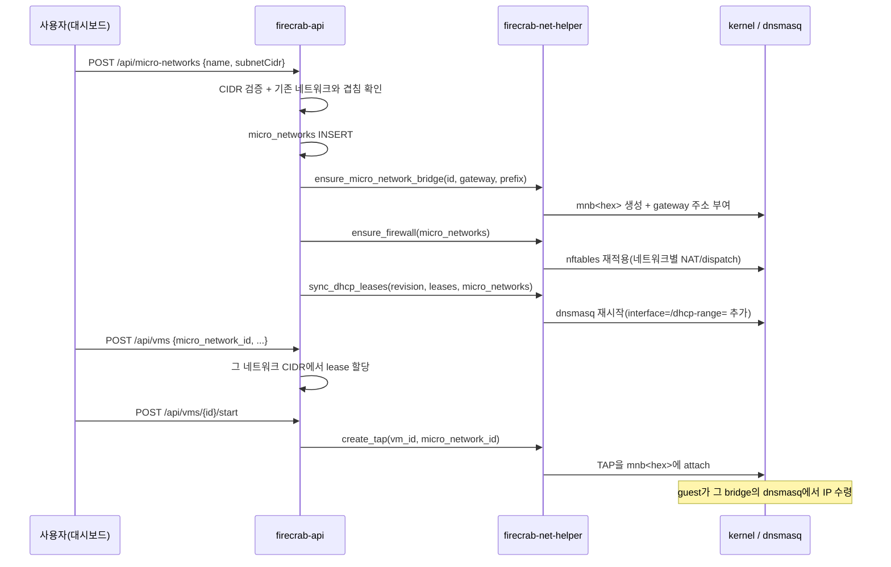

---
tags:
  - firecrab
  - test
  - network
  - micronetwork
updated: 2026-07-30
---

# MicroNetwork 테스트

`docs/task-micro-network.md`의 구현을 확인한다. MicroNetwork를 여러 개 만들고, VM을 그중
하나에 소속시켜 실제로 IP를 받고 외부와 통신하며, 다른 MicroNetwork의 VM과는 통신하지 못하는
것까지가 대상이다.

## 시퀀스 다이어그램



### AWS 비유

| firecrab | AWS 대응 |
|---|---|
| MicroNetwork | VPC + Subnet (통합) |
| MicroNetwork - bridge + gateway | Subnet의 암묵적 라우터 |
| MicroNetwork - `dhcp-range` | VPC DHCP Option Set |
| MicroNetwork - postrouting 규칙 | VPC NAT Gateway |
| MicroNetwork - 인터넷 on/off | Internet Gateway attach/detach |
| VM 생성 시 MicroNetwork 선택 | EC2 launch 시 VPC/Subnet 선택 |
| 다른 MicroNetwork의 VM과 통신 불가 | VPC 간 기본 격리(peering 없음) |
| lease 있는 MicroNetwork 삭제 거부 | ENI가 남은 Subnet 삭제 거부 |

## 자동 테스트 (root 불필요)

```sh
cargo test -p firecrab-helper-protocol network::        # 11
cargo test -p firecrab-net-helper firewall::            # 21
cargo test -p firecrab-net-helper dhcp::                # 17
cargo test -p firecrab-net-helper tap::                 #  3
cargo test -p firecrab-api handlers::micro_networks::   # 19
cargo test -p firecrab-api ipam::                       # 11
cargo test -p firecrab-api persistence::                # 12
cargo test -p firecrab-api handlers::vms::              # 45
```

전체: `cargo test --workspace` → 154/20/16/56

## 확인 항목 (자동 테스트가 덮는 범위)

리소스:
- 생성 → 목록 → 삭제 왕복, `gateway`는 저장 없이 `subnet_cidr`에서 유도
- 상세 조회: 브릿지 이름이 helper가 실제로 만드는 이름과 같음, 사용 가능 주소 수(/24 → 253),
  소속 VM만 나열(다른 네트워크 VM 제외), 없는 id는 404
- CIDR 형식·prefix 범위(`/16`~`/28`) 검증, 잘못된 요청은 DB에 손도 안 댐
- 기존 MicroNetwork·기본 네트워크와 겹치는 CIDR은 **필드 검증 오류**(400) — bridge까지 갔다가
  롤백되는 게 아니라 그 전에 거부
- bridge 프로비저닝 실패 시 방금 넣은 row 롤백(고아 레코드 없음)
- active lease가 있으면 삭제 거부(409), lease 해제 후엔 삭제 성공

네트워크별 파라미터화:
- `MicroNetworkSpec`이 gateway/prefix에서 network 주소·CIDR·bridge 이름을 유도(넘어가는 문자열 없음)
- firewall: bridge마다 forward dispatch 쌍, subnet마다 postrouting 규칙, masquerade 체인은 1개
- firewall: 모든 firecrab subnet이 목적지 deny 목록에 들어가 네트워크 간 라우팅 차단
- firewall: 네트워크가 추가되면 렌더링 결과가 달라져 재적용됨(같으면 `nft` 미호출)
- dhcp: 네트워크마다 `interface=`/`dhcp-range=`, 기본 네트워크도 그대로 유지
- dhcp: 네트워크 집합이 바뀌면 revision이 같아도 stale로 안 넘김(새 네트워크는 lease가 없어
  revision이 안 오름)
- dhcp: `dhcp_release`가 그 IP를 실제로 서빙하는 bridge로 전송됨
- tap: `micro_network_id`가 있으면 그 네트워크 bridge, 없으면 `fcbr0`
- ipam: lease가 소속 네트워크 CIDR에서 나옴, 기본 네트워크 VM은 `172.30.0.x` 유지
- helper: `prefix`를 8~30으로 재검증(API의 16~28과 별개, 신뢰 경계)
- 재적용: VM이 없는 네트워크까지 bridge를 다시 ensure하고, helper 실패는 삼키지 않고 전달
- 인터넷 off: 그 subnet의 postrouting 규칙이 사라지고 `ip saddr { <subnet> } drop`이 추가됨
  (established/related accept **뒤**, per-VM 맵 **앞** — 응답은 살고 새 흐름만 막힘)
- 인터넷 off: 렌더링 결과가 달라져 `nft` 재적용이 실제로 일어남(같으면 조용히 안 걸림)
- 인터넷 토글: 저장 → helper 적용 실패 시 저장값 롤백, 없는 id는 404
- 마이그레이션: 컬럼 없던 기존 DB의 네트워크는 `internet_enabled = 1`(예전 동작)로 열림
- 재적용 후 실행 중 VM의 개별 정책 재설치(전역 apply가 테이블을 flush하므로) — 순서도 검증

## 수동 확인 (root 필요)

> **주의**: 이미 떠 있는 net-helper를 교체해야 한다. 첫 `sync_dhcp_leases`에서 dnsmasq가
> **재시작**되므로 실행 중인 VM의 DHCP가 잠깐 끊긴다(이미 받은 lease는 유지). 실행 중인
> VM이 있으면 먼저 정지하는 편이 안전하다.

### 터미널 세션 1 — helper 실행

```sh
cargo build -p firecrab-net-helper -p firecrab-api

# 기존 helper 중지
sudo pkill -f target/debug/firecrab-net-helper

sudo -u root -g "$(id -gn)" \
     FIRECRAB_NET_HELPER_ALLOWED_UID="$(id -u)" \
     ./target/debug/firecrab-net-helper
```

### 터미널 세션 2 — API 실행

**반드시 저장소 루트에서 실행한다.** DB(`data/firecrab.db`)와 VM 아티팩트(`data/vms/<id>/`)
경로가 cwd 기준이라, `cd firecrab-api` 후 실행하면 전혀 다른(오래된) DB를 열게 된다.

```sh
pkill -f 'target/debug/firecrab-api'   # 이전 인스턴스 종료(포트 3000 점유 + 구 바이너리)
cargo run -p firecrab-api              # 저장소 루트에서
```

> **호스트 UFW 주의**: UFW를 쓰는 머신이면 MicroNetwork 브리지마다 DHCP/DNS 허용이 필요하다.
> 없으면 guest가 `no-ipv4-address`로 실패한다(`docs/troubleshooting.md` 참고).
>
> ```sh
> sudo ufw allow in on <mnb브리지> to any port 67 proto udp
> sudo ufw allow in on <mnb브리지> to any port 53
> sudo ufw route allow in on <mnb브리지> out on <업링크>
> ```

### 터미널 세션 3 — MicroNetwork 생성·확인

```sh
# 1) 네트워크 2개 생성
curl -s -X POST localhost:3000/api/micro-networks \
     -H 'content-type: application/json' \
     -d '{"name":"prod","subnetCidr":"172.31.0.0/24"}' | tee /tmp/mn-prod.json
curl -s -X POST localhost:3000/api/micro-networks \
     -H 'content-type: application/json' \
     -d '{"name":"stage","subnetCidr":"172.32.0.0/24"}' | tee /tmp/mn-stage.json

# 1-1) 상세 조회 — 서브넷/브릿지/NAT/방화벽/소속 VM을 한 번에
PROD=$(python3 -c 'import json;print(json.load(open("/tmp/mn-prod.json"))["id"])')
curl -s localhost:3000/api/micro-networks/$PROD | python3 -m json.tool

# 2) 실제 host 자원 확인
ip -br addr show type bridge | grep mnb     # mnb<hex> 2개, 172.31.0.1/24 · 172.32.0.1/24
sudo nft list table inet firecrab | grep -E 'jump firecrab_(egress|postrouting)|ip daddr \{'
grep -E '^(interface|dhcp-range)' /run/firecrab/dnsmasq.conf   # 네트워크 3개(기본 포함)

# 3) 겹치는 CIDR은 400 + 레코드/브리지 없음
curl -s -o /dev/null -w '%{http_code}\n' -X POST localhost:3000/api/micro-networks \
     -H 'content-type: application/json' \
     -d '{"name":"clash","subnetCidr":"172.31.0.0/16"}'        # 400
```

### 터미널 세션 3 — VM 소속·통신 확인

```sh
PROD=$(python3 -c 'import json;print(json.load(open("/tmp/mn-prod.json"))["id"])')

# 4) 그 네트워크에 VM 생성 → start
curl -s -X POST localhost:3000/api/vms -H 'content-type: application/json' \
     -d "{\"name\":\"prod-vm\",\"template\":\"alpine-3.24\",\"cpu\":1,\"ram\":512,
          \"diskGb\":2,\"microNetworkId\":\"$PROD\"}" | tee /tmp/vm-prod.json
VM=$(python3 -c 'import json;print(json.load(open("/tmp/vm-prod.json"))["id"])')
curl -s -X POST localhost:3000/api/vms/$VM/start

# 5) 확인: ipv4가 172.31.0.x, TAP이 그 bridge에 붙음
curl -s localhost:3000/api/vms/$VM | python3 -m json.tool | grep -E 'ipv4|microNetworkId|state'
ip link show master $(ip -br link show type bridge | grep mnb | head -1 | cut -d' ' -f1)

# 6) 대시보드 터미널(또는 콘솔 로그)에서 guest 안 확인
#    ip -4 addr show eth0   → 172.31.0.x
#    ping -c2 <gateway>     → 172.31.0.1 응답
#    ping -c2 1.1.1.1       → NAT 통과
```

### 재적용 확인 (재부팅 복구)

```sh
# VM이 하나도 없는 네트워크의 bridge를 강제로 없앤 뒤 API만 재시작하면 되살아나야 한다
sudo ip link delete <mnb브리지>
pkill -x firecrab-api && cargo run -p firecrab-api
ip -br addr show type bridge | grep mnb     # 주소까지 그대로 복구
```

### 인터넷 on/off 확인

```sh
# 9) 인터넷 차단으로 전환 (AWS의 IGW detach에 해당)
curl -s -X PATCH localhost:3000/api/micro-networks/$PROD \
     -H 'content-type: application/json' -d '{"internetEnabled":false}' | python3 -m json.tool

# 규칙 확인: 그 subnet의 masquerade 규칙이 사라지고 drop 규칙이 생김
sudo nft list table inet firecrab | grep -E 'postrouting|172.31.0.0/24'
#   ip saddr 172.31.0.0/24 oifname ... jump firecrab_postrouting  → 없어야 함
#   ip saddr { 172.31.0.0/24 } drop                               → 있어야 함

# guest 안에서: 내부는 살아 있고 외부만 막힘
#   ping -c2 172.31.0.1   → gateway 응답 (DHCP/DNS도 그대로)
#   ping -c2 1.1.1.1      → 100% loss
#   (기존에 열려 있던 연결은 established라 바로 끊기지 않을 수 있음)

# 10) 다시 연결로 되돌리면 외부 통신 복구
curl -s -X PATCH localhost:3000/api/micro-networks/$PROD \
     -H 'content-type: application/json' -d '{"internetEnabled":true}' > /dev/null
```

### 격리 확인

```sh
# stage 네트워크에도 VM 하나 만들어 start 한 뒤, prod VM 게스트에서:
#    ping -c2 172.32.0.<stage-vm-ip>   → 100% loss 여야 함
sudo nft list table inet firecrab | grep 'ip daddr {'   # 두 subnet 모두 deny 목록에 있음
```

### 삭제 가드 확인

```sh
# 7) VM이 남아 있는 동안은 409
curl -s -o /dev/null -w '%{http_code}\n' -X DELETE localhost:3000/api/micro-networks/$PROD  # 409

# 8) VM 삭제 후에는 204, bridge도 사라짐
curl -s -X DELETE localhost:3000/api/vms/$VM
curl -s -o /dev/null -w '%{http_code}\n' -X DELETE localhost:3000/api/micro-networks/$PROD  # 204
ip -br link show type bridge | grep mnb      # prod의 mnb<hex>가 없어야 함
```

### 브라우저 확인

`docs/browser-test.md`대로 dev 서버(`npm run dev`, http://localhost:8080)를 띄우고:

- 헤더 "MicroNetwork" → 목록에 name/subnet/gateway/인터넷 표시, 생성·삭제 동작
- 생성 폼의 "인터넷" 선택(연결/차단)이 목록의 인터넷 열에 그대로 반영
- 행의 "인터넷 차단"/"인터넷 연결" 버튼 → 열과 상세의 NAT 줄이 함께 바뀜
- 목록에서 행을 클릭 → 상세 패널에 네트워크 ID / 서브넷(주소 사용량·DHCP) / 브릿지(TAP 수) /
  NAT(출발 대역 → 업링크) / 방화벽(차단 항목) / 소속 VM 표시
- VM 생성 폼의 "MicroNetwork" 드롭다운에 방금 만든 네트워크가 뜨고, 선택해서 생성
- VM 상세에 "MicroNetwork" 행이 `이름 (CIDR)`로 표시(미선택 VM은 "기본 네트워크")

## helper만 단독으로 확인 (API 없이)

`docs/tests/net-helper-client.py`가 JSON 값을 그대로 파싱하므로 새 요청도 보낼 수 있다.

```sh
sudo FIRECRAB_NET_HELPER_SOCK=/tmp/firecrab-net.sock \
     FIRECRAB_NET_HELPER_ALLOWED_UID="$(id -u)" ./target/debug/firecrab-net-helper &

MN=$(uuidgen)
sudo python3 docs/tests/net-helper-client.py /tmp/firecrab-net.sock \
     ensure_micro_network_bridge micro_network_id=$MN gateway=172.31.0.1 prefix=24
sudo python3 docs/tests/net-helper-client.py /tmp/firecrab-net.sock \
     ensure_firewall "micro_networks=[{\"micro_network_id\":\"$MN\",\"gateway\":\"172.31.0.1\",\"prefix\":24,\"internet_enabled\":false}]"
sudo python3 docs/tests/net-helper-client.py /tmp/firecrab-net.sock \
     remove_micro_network_bridge micro_network_id=$MN
```

- `prefix=7`이나 `prefix=31`은 `invalid_request`로 거부되는지도 같이 확인

## 완료 기준 대조

- MicroNetwork를 여러 개 만들고 각자 독립된 subnet/bridge/gateway를 가진다
  — 실 host 확인(2026-07-24: `mnb<hex>` + `172.31.0.1/24` 생성·삭제)
- VM 생성 시 소속 MicroNetwork를 선택하고, 그 네트워크 IP를 받아 외부와 통신한다
  — 실 host 확인(2026-07-29: `172.31.0.4` lease, guest `apk update` 성공)
- 네트워크별 인터넷 on/off가 실제로 외부 통신을 끊고 되살린다
  — 실 host 확인(2026-07-29: off → `apk update` exit 2 + postrouting 규칙 소멸,
    호스트↔VM ping은 0% loss 유지, on → 다시 성공)
- 재적용이 VM 없는 네트워크의 bridge를 되살린다 — 실 host 확인(2026-07-29)
- 서로 다른 MicroNetwork의 VM은 통신하지 못한다 — 자동 테스트만(두 번째 네트워크 VM 미생성)
- lease가 있는 MicroNetwork는 삭제되지 않는다 — 자동 테스트로 확인, 실 host 미검증
- 하나를 삭제해도 다른 네트워크·기본 네트워크의 VM은 영향받지 않는다 — 미검증

## 정리

```sh
# 남은 MicroNetwork를 API로 삭제하면 bridge까지 정리됨. 수동으로 남은 게 있으면:
sudo ip link delete <mnb-name>
# helper는 Ctrl-C (socket 제거). nftables 테이블은 helper가 지우지 않음:
sudo nft delete table inet firecrab
sudo nft delete table bridge firecrab_l2
```
