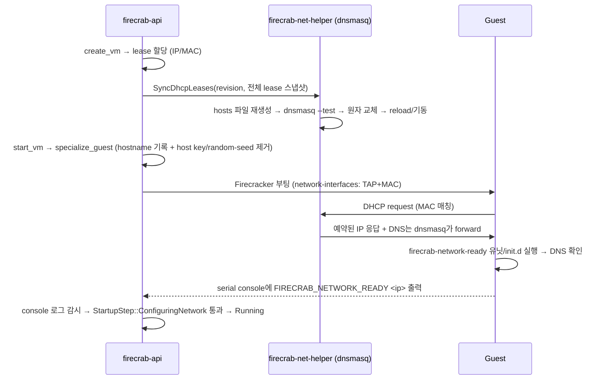

# Guest 네트워크 설정 스모크 테스트

## 아키텍처



## AWS로 비유하면

앞서 정리한 `docs/task-guest-network-configuration.md`의 표와 동일 — 이 스모크 문서는 그 구현이 실제로 도는지 확인하는 절차만 다룬다.

## 자동 테스트 (root 불필요)

```sh
cargo test -p firecrab-api ipam::lease_revision_bumps_on_both_allocate_and_release
cargo test -p firecrab-api ipam::active_leases_lists_only_unreleased_rows
cargo test -p firecrab-helper-protocol network::guest_hostname_is_deterministic_and_distinct_per_vm
cargo test -p firecrab-helper-protocol network::sync_dhcp_leases_serializes_with_its_operation_tag
cargo test -p firecrab-net-helper dhcp::
cargo test -p firecrab-api rootfs::specialize_guest_
cargo test -p firecrab-api handlers::vms::find_network_sentinel_
cargo test -p firecrab-api handlers::vms::start_fails_when_guest_
```

## 확인 항목

- lease 세대(revision) — `PRAGMA user_version`을 allocate/release 양쪽에서 bump, 재사용 없이 항상 증가
- `active_leases` — released 안 된 lease만 반환
- guest hostname — `fc-<sha256(vm_id) 12자리>`, `tap_name`과 동일 방식으로 결정적·VM마다 상이
- `render_hosts_file` — lease당 `dhcp-host=<mac>,<ip>,<hostname>` 한 줄, 빈 스냅샷은 빈 문자열
- 생성된 dnsmasq 설정이 실제 `dnsmasq --test`(진짜 바이너리, root 불필요)로 문법 검증 통과 확인
- base config 문법 오류(`dhcp-range=not,valid,at,all`류)는 `dnsmasq --test`가 실제로 거부하는지 확인 — 단, `--dhcp-hostsfile`이 가리키는 파일의 *내용*까지는 `--test`가 검사하지 않음(dnsmasq 자체의 한계, 확인됨) → 그래서 hosts 파일 내용은 항상 이미 타입 검증된 `MacAddr`/`Ipv4Addr`에서만 생성되게 설계
- 오래된/중복 revision 스냅샷은 무시(재적용 안 됨)
- `specialize_guest` — 진짜 작은 ext4 이미지(`mkfs.ext4`)에 `debugfs -w`로 hostname 기록, SSH host key/random-seed 제거, 두 번 호출해도(재시작) 안 깨짐(idempotent), 배포판에 없는 경로는 조용히 통과
- 네트워크 sentinel 파싱 — `FIRECRAB_NETWORK_READY`/`FIRECRAB_NETWORK_FAILED` 인식, 청크 경계에 걸쳐 나뉜 줄도 재조립 버퍼로 인식
- 전체 lifecycle 테스트(`start_then_stop_runs_the_full_lifecycle` 등)에서 가짜 Firecracker가 sentinel을 찍도록 해서, 실제로 `StartupStep::ConfiguringNetwork` 단계를 통과해야 `Running`까지 간다는 것 확인
- guest가 sentinel을 끝까지 안 찍으면(`start_fails_when_guest_never_reports_network_ready`) 또는 `FIRECRAB_NETWORK_FAILED`를 찍으면(`start_fails_when_guest_reports_network_failure`) start 자체가 실패로 끝남 확인

## 수동 확인 (root/CAP_NET_ADMIN 필요, 실제 rootfs 재빌드 필요)

이 sandbox에는 CAP_NET_ADMIN이 없어 dnsmasq가 실제로 `fcbr0`에 bind해서 진짜 DHCP lease를 내주는 것, 그리고 실제 Ubuntu/Alpine 이미지를 다시 빌드해 부팅한 뒤 sentinel이 실제로 찍히는지는 검증하지 못했다. 위 자동 테스트는 설정 생성·검증·idempotency·readiness 판정 로직만 보장한다.

### 터미널 세션 1 — helper + dnsmasq 실행

```sh
cargo build -p firecrab-net-helper
sudo FIRECRAB_NET_HELPER_SOCK=/tmp/firecrab-net.sock \
     FIRECRAB_NET_HELPER_ALLOWED_UID="$(id -u)" \
     ./target/debug/firecrab-net-helper
```

### 터미널 세션 2 — 실제 lease 동기화 + dnsmasq 상태 확인

```sh
sudo python3 docs/tests/net-helper-client.py /tmp/firecrab-net.sock ensure_bridge
sudo python3 docs/tests/net-helper-client.py /tmp/firecrab-net.sock sync_dhcp_leases \
  revision=1 leases='[{"vm_id":"<uuid>","ipv4":"172.30.0.5","mac":"02:fc:00:00:00:05"}]'
ps aux | grep dnsmasq
cat /run/firecrab/dnsmasq-hosts.conf
```

기대: dnsmasq 프로세스가 `--interface=fcbr0 --bind-interfaces`로 떠 있고, hosts 파일에 지정한 예약이 그대로 들어있다.

### 터미널 세션 3 — golden image 재빌드 + 실제 부팅

```sh
scripts/firecracker-menual/install-ubuntu-roofs.sh   # DHCP=yes + sentinel 유닛 반영 확인
scripts/firecracker-menual/install-alpine-rootfs.sh  # sentinel init.d 반영 확인
```

이후 실제 `firecrab-api`로 VM 생성·시작해서, 대시보드/콘솔 로그에 `FIRECRAB_NETWORK_READY <ip>`가 찍히고 `configuringNetwork` 단계를 지나 `running`이 되는지 확인.

## 완료 기준 대조

- DB lease = Firecracker MAC = guest `eth0` 실제 주소 일치 — 미검증(실제 부팅 필요)
- 재부팅해도 같은 IP·gateway·DNS 유지 — 미검증(lease는 stop에서 안 지워지므로 설계상 유지되어야 하나, 실제 재부팅 확인 안 함)
- DNS 실패는 네트워크 준비 단계에서 즉시 실패 — **로직 확인 완료**(`start_fails_when_guest_reports_network_failure`), 실제 guest에서의 DNS 실패 시나리오는 미검증

## 정리

터미널 세션 1에서 `Ctrl-C`로 helper 종료. dnsmasq는 net-helper의 자식 프로세스라 helper 종료 시 같이 죽는다. `/run/firecrab/dnsmasq-hosts.conf`류 파일은 직접 정리.

```sh
sudo rm -f /run/firecrab/dnsmasq-hosts.conf* /run/firecrab/dnsmasq.pid
```
