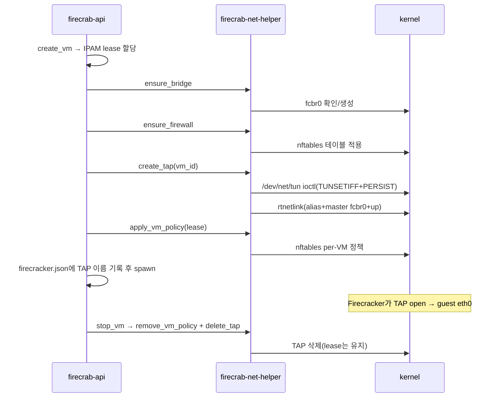

# VM별 TAP 자동화 스모크 테스트

## 시퀀스 다이어그램



### AWS 비유

| firecrab | AWS 대응 |
|---|---|
| Firecracker microVM | EC2 인스턴스 |
| `fcbr0` 브리지 + `172.30.0.0/24` | VPC 서브넷 |
| IPAM lease (IP+MAC) | ENI에 할당되는 private IP |
| TAP 디바이스 | ENI(Elastic Network Interface) |
| `create_tap` + bridge attach | ENI 생성 + 인스턴스 attach |
| alias `firecrab:<vm_id>` | ENI attachment 메타데이터(소유 인스턴스 식별) |
| `apply_vm_policy`(nftables) | ENI에 붙는 Security Group |
| `stop_vm`: TAP 삭제, lease 유지 | 인스턴스 Stop: private IP 유지, 실연결만 해제 |
| `start_vm`: 같은 lease로 TAP 재생성 | 인스턴스 Start: 같은 private IP로 재연결 |
| `delete_vm`: lease 해제 | 인스턴스 Terminate: ENI 삭제, private IP 반납 |

## 자동 테스트 (root 불필요)

```sh
cargo test -p firecrab-helper-protocol network::
cargo test -p firecrab-net-helper tap::
cargo test -p firecrab-net-helper deleting_a_tap
cargo test -p firecrab-api network::
cargo test -p firecrab-api ipam:: persistence::
cargo test -p firecrab-api handlers::vms::
```

## 확인 항목

- TAP 이름: `vm_id` 결정적, IFNAMSIZ 이내, API·helper 공유 함수로 재계산(임의 이름 불가)
- ownership alias `firecrab:<vm_uuid>` 포맷 검증
- `ifreq` 인코딩(NUL 종료, `IFF_TAP|IFF_NO_PI`) 검증
- 미존재 TAP 삭제 no-op
- `create_tap`도 재사용 전 소유권 확인 — alias 안 맞는 기존 링크는 거부(덮어쓰기 안 함)
- lease 할당(`create_vm`)·해제(`delete_vm`), 실패 시 rollback
- `setup_vm_network` 성공 경로 — fake net-helper로 전체 lifecycle 확인
- `apply_vm_policy` 실패 시 `remove_vm_policy`+`delete_tap` 순서로 호출됨을 call-sequence 테스트로 확인
- 중간 실패 시 새로 만든 TAP도 compensation으로 삭제 (Drop 비의존)
- `stop_vm` 시 teardown(remove_vm_policy+delete_tap), lease는 delete까지 유지
- 게스트 자체 종료(poweroff)·프로세스 kill로 인한 종료도 exit monitor가 teardown 호출(이전엔 `stop_vm` 경유 종료만 정리됨)

## 수동 확인 (root/CAP_NET_ADMIN 필요)

- 개발 sandbox: 미검증(CAP_NET_ADMIN 없음) — `create_tap`의 소유권 선확인·실패 시 신규 디바이스 삭제 로직도 포함
- 실제 root 환경 검증 완료(2026-07-22): 서로 다른 두 `vm_id` → 다른 TAP 2개, 둘 다 `master fcbr0`, alias 일치, `ifreq` 플래그 반영 확인
- 미검증: 이름 충돌(다른 소유자) 시 거부, 실패 주입 시 고아 TAP 없음, daemon 재시작 후 orphan 없음, `delete_tap` ownership 재확인

### 터미널 세션 1 — helper 실행

```sh
cargo build -p firecrab-net-helper
sudo FIRECRAB_NET_HELPER_SOCK=/tmp/firecrab-net.sock \
     FIRECRAB_NET_HELPER_ALLOWED_UID="$(id -u)" \
     ./target/debug/firecrab-net-helper
```

### 터미널 세션 2 — TAP 생성·조회

- `create_tap`/`delete_tap`은 `vm_id=<uuid>` 형식 필수(맨 uuid만 넘기면 파싱 실패로 무응답 종료)
- `create_tap` 전 `ensure_bridge` 선행 필요(없으면 `MissingBridge`)
- `state DOWN`/`NO-CARRIER`는 정상(Firecracker가 열기 전까지)

```sh
sudo python3 docs/tests/net-helper-client.py /tmp/firecrab-net.sock ensure_bridge
sudo python3 docs/tests/net-helper-client.py /tmp/firecrab-net.sock create_tap vm_id=<vm-uuid-1>
sudo python3 docs/tests/net-helper-client.py /tmp/firecrab-net.sock create_tap vm_id=<vm-uuid-2>
ip link show master fcbr0
ip -d link show <tap-name-1>
```

### 완료 기준 대조

- 두 VM이 다른 TAP으로 같은 bridge에 연결 — 확인 완료(2026-07-22)
- 실패 주입에도 고아 TAP 없음 — 미검증
- daemon 복구 후 고아 TAP 없음 — 미검증

```sh
sudo ip link delete <tap-name-1>
sudo ip link delete <tap-name-2>
```

## 정리

`Ctrl-C`로 helper 종료 시 socket 제거, TAP은 커널에 남으므로 `ip link delete`로 직접 정리.
