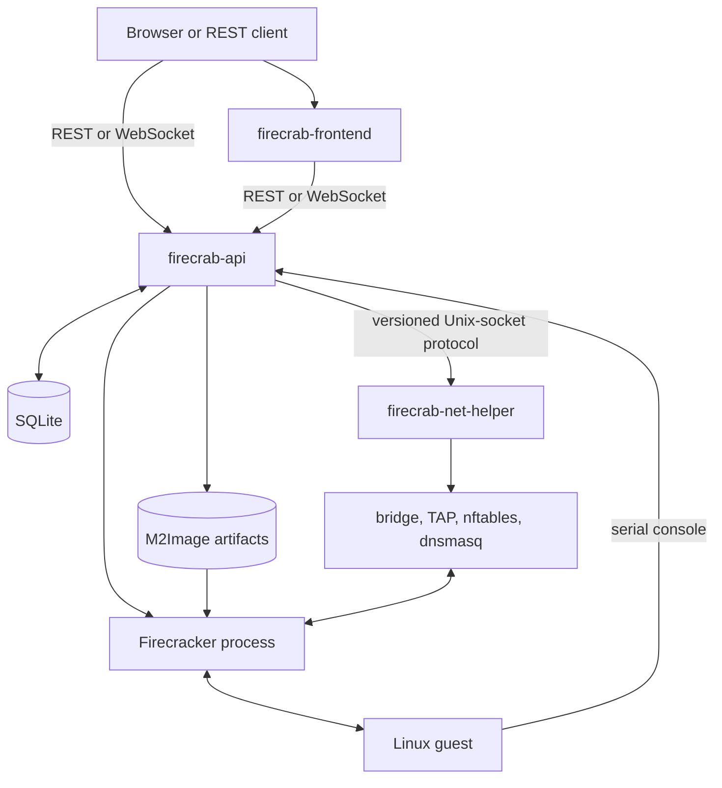
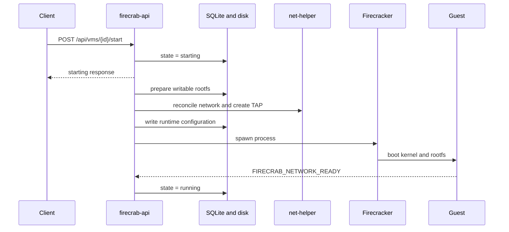

# Firecrab architecture

Firecrab is a single-host control plane for Firecracker microVMs.
It adds image, network, storage, state, and browser-console management around Firecracker.
It is not a multi-host scheduler, HA cluster, live-migration system, or hosted cloud service.

## System overview



The installed API also serves the built dashboard.
Development uses Vite for the dashboard and proxies `/api` and `/ws` to the API.

## Components

| Component | Responsibility | Privilege |
| --- | --- | --- |
| `firecrab-frontend` | VM, image, network, storage, and console UI | Browser only |
| `firecrab-api` | REST, WebSocket, VM lifecycle, SQLite, and artifact validation | Unprivileged service account |
| `firecrab-net-helper` | Bridge, TAP, DHCP, DNS, NAT, firewall, and port forwarding | Bounded Linux capabilities |
| `firecrab-helper-protocol` | Versioned typed messages between the API and helper | None |
| `firecrab-api-types` | Shared request and response models | None |
| Firecracker | Runs one guest kernel and rootfs | One process per running VM |
| SQLite | Stores durable control-plane state | Written by the API |

## Resource model

| Resource | Meaning |
| --- | --- |
| MicroVM | A VM with an image, CPU, RAM, disk, network, and egress policy |
| MicroNetwork | A subnet with its own bridge, gateway, and internet state |
| MicroStorage | A registered host directory for VM disks |
| M2Image | A verified kernel and rootfs template |
| MicroRegistry | The published M2Image catalog and package source |
| MicroBoot | An image-build workflow that uses a temporary builder VM |

Every MicroVM selects one MicroNetwork and one storage root.
There is no hidden default network.
A VM request cannot supply an arbitrary host filesystem path.

## VM start flow

A start request claims the VM as `starting` and returns before the guest finishes booting.
The remaining work runs in a background task.



The startup timeline records disk preparation, configuration, process start, and network readiness.
The guest readiness sentinel proves that DHCP and DNS work inside the guest.
A host-side DHCP lease alone is not sufficient.
Failure rolls back the process, firewall policy, and TAP where possible.
A monitor records process exit and removes runtime network state.
Disk preparation concurrency is bounded to protect host I/O.
Network mutations are serialized so an old firewall snapshot cannot remove a newer policy.

## Networking

Each MicroNetwork gets an `mnb*` bridge derived from its UUID.
Each VM gets an `fct*` TAP derived from its UUID.
The helper derives interface names instead of accepting user-controlled names.

- IPv4 and MAC leases are stored in SQLite.
- Internet access requires both the network and VM egress policies to allow it.
- Port forwarding creates nftables DNAT rules from host ports to guest ports.
- Traffic between different MicroNetworks is blocked by default.
- The current implementation also blocks L2 traffic between VM TAPs.
- Same-network VM traffic is tracked by [issue #72](https://github.com/SteelCrab/firecrab/issues/72).
- The complete desired firewall state is applied as one nftables transaction.

The helper checks the Unix-socket peer UID and protocol version.
Its systemd unit grants only the capabilities required for host networking.

## Storage and images

```text
<storage-root>/vms/<vm-id>/
  d/<generation-id>.ext4
  r/<runtime-id>/
    fc.json
    fc.sock
    console.log
```

The disk generation survives stop and start.
The runtime directory belongs to one start attempt.
MicroStorage registers an already mounted directory.
Firecrab does not partition, format, or mount physical disks.

An M2Image contains a kernel, an optional initramfs, an ext4 rootfs, and boot arguments.
The API verifies artifact hashes and confines paths to the configured image root.
MicroRegistry downloads a package into staging before a separate install step.
MicroBoot builds the same package format in a temporary builder VM.
Only installed and registered images can create normal VMs.

## Console and state

The API console broker connects Firecracker serial input and output to the browser WebSocket.
The same stream is written to `console.log` and parsed for readiness, operation, and usage signals.

| State | Location | Recovery |
| --- | --- | --- |
| VM, network, storage, lease, and port-forward records | SQLite WAL | Loaded at API startup |
| M2Images and VM disks | Filesystem | Paths and hashes are verified |
| Firecracker process handles and job progress | API memory | Not recovered after restart |
| Bridge, TAP, nftables, and dnsmasq state | Linux runtime | Reconciled from desired state |

API startup demotes stale active VM records because the new process owns no matching handles.
SQLite and VM artifacts are the durable source of truth.
Manually added Firecrab nftables rules are not guaranteed to survive reconciliation.

## Security boundaries

- The HTTP listener binds to loopback by default.
- Browser mutations must pass the origin policy.
- REST requests have body-size, timeout, and concurrency limits.
- The API runs unprivileged and delegates host networking to the helper.
- The helper revalidates peer UID, protocol version, and request fields.
- Image and VM paths are restricted to configured roots.

Do not expose an unauthenticated API listener to an external network.

## Related

- [Architecture summary](architecture.md)
- [Core concepts](concepts.md)
- [Networking](networking.md)
- [Storage](storage.md)
- [Images](images.md)
- [Operations](operations.md)
