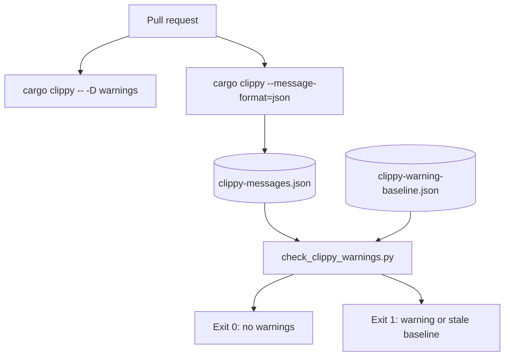

# Clippy warning gate

CI treats Clippy and rustc warnings as failures.

- The main Rust job runs `cargo clippy --workspace --all-targets -- -D warnings`.
- A pull-request job collects Clippy JSON and compares counts to the checked-in baseline.
- The baseline is zero. A new warning fails. A stale baseline also fails.



```sh
cargo clippy --workspace --all-targets -- -D warnings
cargo clippy --workspace --all-targets --message-format=json > clippy-messages.json
python3 scripts/check_clippy_warnings.py clippy-messages.json .github/clippy-warning-baseline.json
```

Do not raise the baseline to allow a warning. Fix the warning instead.

## Related

- [Operations](operations.md)
- [Troubleshooting](troubleshooting.md)
