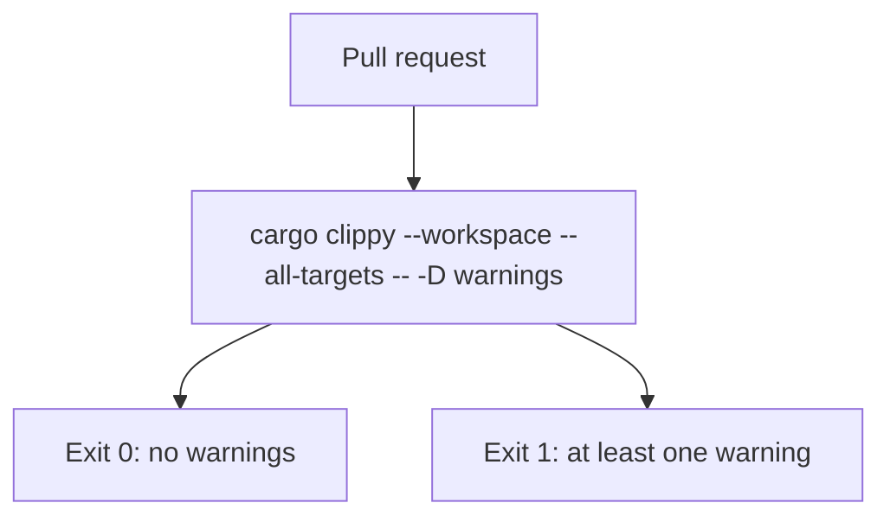

# Clippy warning gate

Clippy runs with `-D warnings`, so a single warning fails the build.

- Runs on every pull request, inside the `Rust (fmt, clippy, test + coverage)` job.
- No baseline file: the accepted number of warnings is zero.
- `dead_code` counts. An item only tests use belongs behind `#[cfg(test)]`.



Run the same check locally before pushing:

```sh
cargo clippy --workspace --all-targets -- -D warnings
```

Apply the machine-applicable suggestions, then review the diff:

```sh
cargo clippy --fix --workspace --all-targets
```

## Related

- [Operations](operations.md)
- [Troubleshooting](troubleshooting.md)
